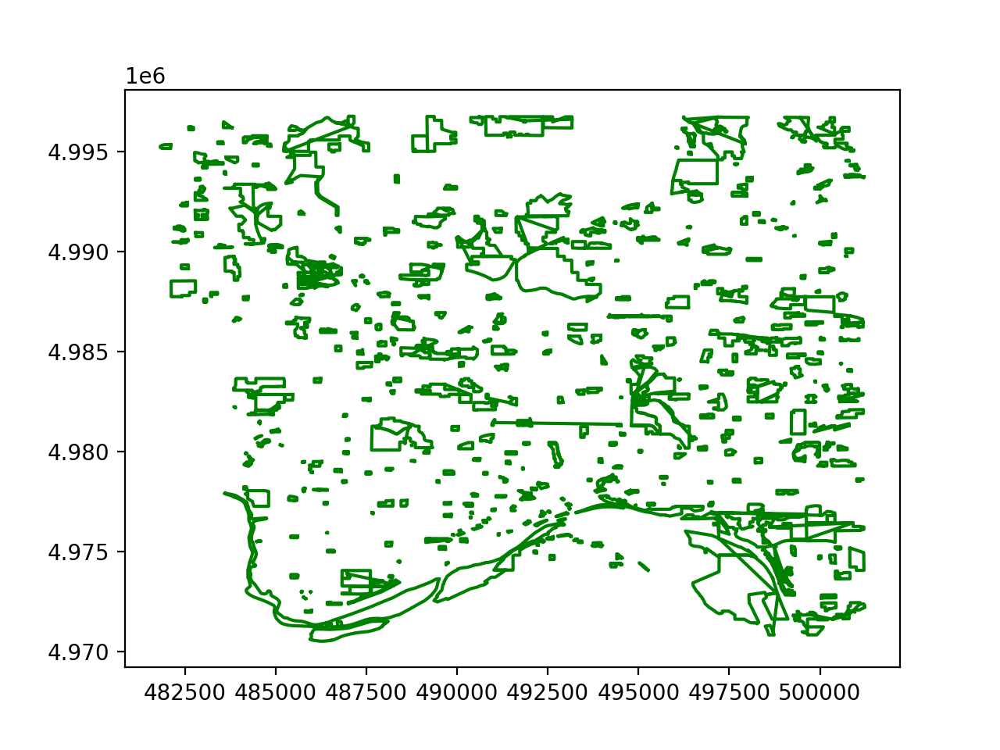
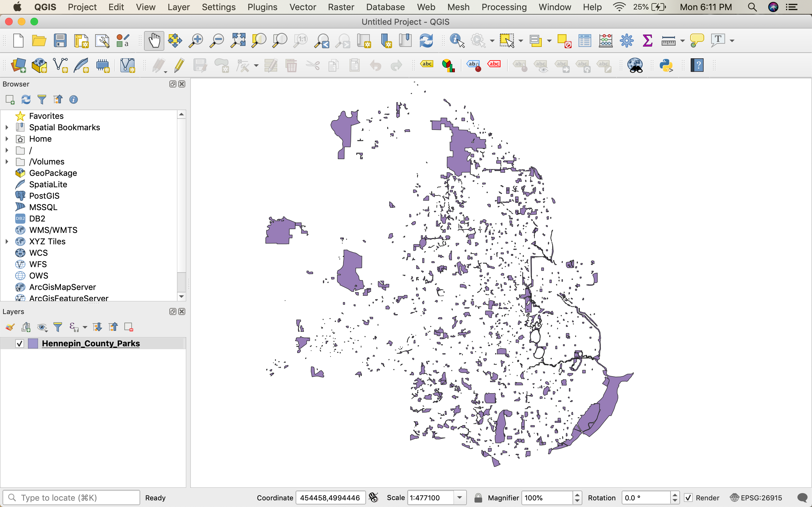

Getting Started
=================
### November 2, 2020

Welcome to a trial-and-error attempt at solid econometric research into
the effect of greenery on home prices. Here are my current attempts at
stitching random shapefiles and Zillow data into a single dataset that
*could* be used to see some meaningful trends:

## Attempt One
### python 'shapefile'
I went and look up directly 'open shapefiles in python' and ended up on 
[this module's site](https://pypi.org/project/pyshp/). Pairing its documentation with (what else)
a stack overflow page, and ending up with this: 

## Attempt Two
### QGis
Changing the style to "fill" did not end up doing what its name implied,
and the weird shapes remained. So I, in confusion, passed this problem
back to bash with a 'open XXXX.shp'. This was surprisingly successful:

The new issue was QGIS is mostly a visual software, and learning how to
create derivations off of the shapes seemed like a serious task. Back
to a comforting language.

## Attempt Three
### geoPandas
I returned to the internet, this time landing on [this article](https://www.guillaumedueymes.com/post/shapefiles_in_python/). Which was very
useful. I installed geoPandas and went to work.

I got the minimum viable product quickly, opening one file was a breeze,
you simply call 'gpd.read\_file("XXXX.shp")', do some python list trickery
'sp.loc[:, 'geometry'].plot()'
